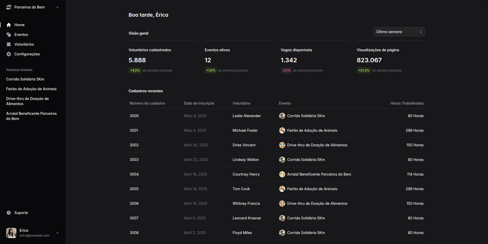
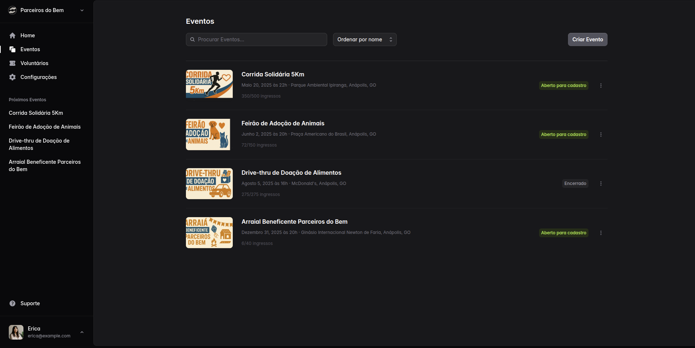
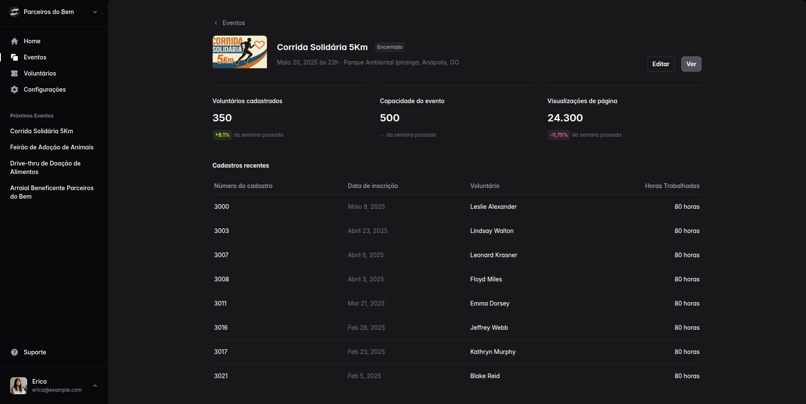
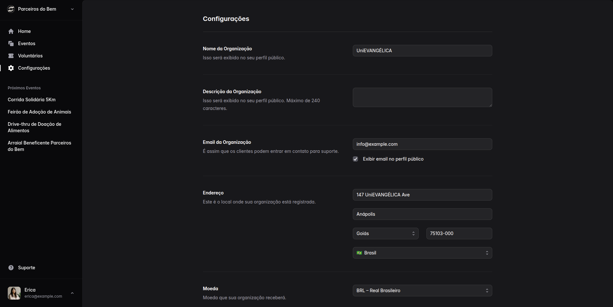
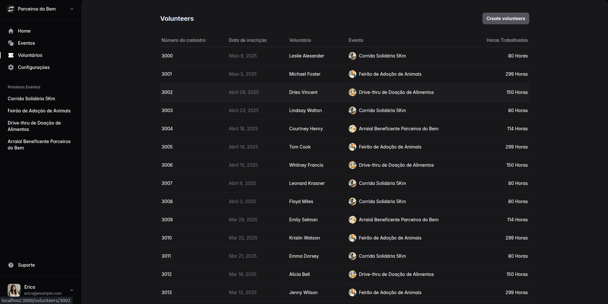
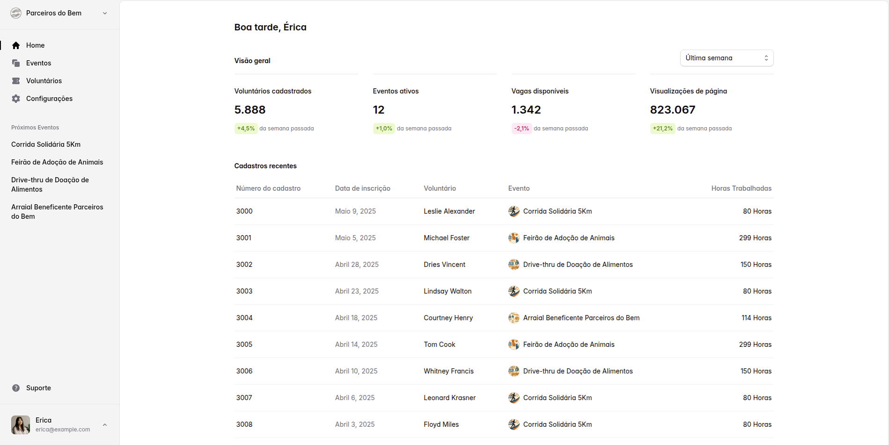

# Parceiros Do Bem

Este repositório contém uma demonstração de um sistema desenvolvido para a UniEVANGÉLICA.  
O objetivo do projeto é ilustrar:


- **Boas práticas de organização** de código, separação de responsabilidades e uso de componentes reutilizáveis.

- **Automação de tarefas** com scripts *npm* e integração contínua opcional (CI).

---

## Pré-requisitos

- **Node.js** ≥ 18  
- **npm** (ou **pnpm** / **yarn** se preferir)

---

## Instalação

```bash
npm install
```

---

## Ambiente de desenvolvimento

```bash
npm run dev
```

O servidor inicia em modo *hot-reload*.
Acesse **[http://localhost:3000](http://localhost:3000)** no navegador para ver o aplicativo em execução.

---

## Scripts adicionais

| Comando         | Descrição                             |
| --------------- | ------------------------------------- |
| `npm run build` | Gera a versão de produção             |
| `npm run start` | Executa o servidor após o build       |
| `npm run lint`  | Analisa o código com ESLint           |

---

## 📸 Galeria







